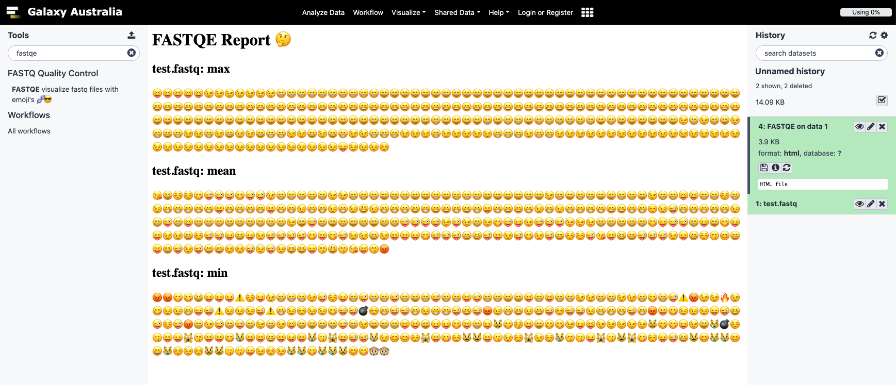

# FASTQ with Emoji = FASTQE 🤔

Read one or more FASTQ files, [fastqe](https://fastqe.com/) will compute quality stats for each file and print those stats as emoji... for some reason.

Given a fastq file in Illumina 1.8+/Sanger format, calculate the mean (rounded) score for each position and print a corresponding emoji!


https://fastqe.com/

# Install

Latest release versions of `fastqe` are available via `pip` or BioConda:

`pip install fastqe`

`conda install -c bioconda fastqe`

## Development

Development version can be isntall from this repository in the `master` branch. 


# Usage

`fastqe` can display usage information on the command line via the `-h` or `--help` argument:
```
usage: fastqe [-h] [--minlen N] [--scale] [--version] [--mean]
              [--custom CUSTOM_DICT] [--bin] [--noemoji] [--min] [--max]
              [--output OUTPUT_FILE] [--long READ_LENGTH] [--log LOG_FILE]
              [FASTQ_FILE [FASTQ_FILE ...]]

Read one or more FASTQ files, compute quality stats for each file, print as
emoji... for some reason.😄

positional arguments:
  FASTQ_FILE            Input FASTQ files

optional arguments:
  -h, --help            show this help message and exit
  --minlen N            Minimum length sequence to include in stats (default
                        0)
  --scale               show relevant scale in output
  --version             show program's version number and exit
  --mean                show mean quality per position (DEFAULT)
  --custom CUSTOM_DICT  use a mapping of custom emoji to quality in
                        CUSTOM_DICT (🐍🌴)
  --bin                 use binned scores (🚫💀💩⚠️😄😆😎😍)
  --noemoji             use mapping without emoji (▁▂▃▄▅▆▇█)
  --min                 show minimum quality per position
  --max                 show maximum quality per position
  --output OUTPUT_FILE  write output to OUTPUT_FILE instead of stdout
  --long READ_LENGTH    enable long reads up to READ_LENGTH bp long
  --log LOG_FILE        record program progress in LOG_FILE
```


## Convert

`fastqe` will summarise FASTQ files to display the max, mean and minumum quality using emoji. To convert a file into this format, rather than summarise, you can use the companion program `biomojify` that will convert both sequence and quality information to emoji:

```
$ cat test.fq
@ Sequence
GTGCCAGCCGCCGCGGTAGTCCGACGTGGC
+
GGGGGGGGGGGGGGGGGGGGGG!@#$%&%(
```

```
$ biomojify fastq test.fq
▶️  Sequence
🍇🍅🍇🌽🌽🥑🍇🌽🌽🍇🌽🌽🍇🌽🍇🍇🍅🥑🍇🍅🌽🌽🍇🥑🌽🍇🍅🍇🍇🌽
😁😁😁😁😁😁😁😁😁😁😁😁😁😁😁😁😁😁😁😁😁😁🚫😄👺💔🙅👾🙅💀
```

Intall with `pip install biomojify`, and see the `biomojify` page for more information: https://github.com/fastqe/biomojify/


# Quickstart

`fastqe test.fastq`

`fastqe --min test.fastq`

`fastqe --max test.fastq`

`fastqe --max -min -bin test.fastq`


# Teaching Materials

## Command line and NGS Introduction

This lesson introduces NGS process in the command line using by using the results of FASTQE before and after quality filerting
using `fastp`:

[https://qubeshub.org/publications/1092/2](https://qubeshub.org/publications/1092/2) 

```
Rachael St. Jacques, Max Maza, Sabrina Robertson, Guoqing Lu, Andrew Lonsdale, Ray A Enke (2019).
A Fun Introductory Command Line Exercise: Next Generation Sequencing Quality Analysis with Emoji!.
NIBLSE Incubator: Intro to Command Line Coding Genomics Analysis, (Version 2.0).
QUBES Educational Resources. doi:10.25334/Q4D172

```

## Galaxy

A Galaxy wrapper is available from the [IUC toolshed](https://toolshed.g2.bx.psu.edu/repository?repository_id=13576f42f394cfb6). Contact your Galaxy Admin
 if you would like to have it installed. A Galaxy Tutorial using FASTQE is in development.



# History

FASTQE started out as part of PyCon Au presentations:


- PyCon Au 2016 - [Python for science, side projects and stuff!](https://www.youtube.com/watch?v=PCZS9wqBUuE)
- PyCon Au 2017 - [Lightning Talk](https://youtu.be/WywQ6a3uQ5I?t=33m18s)
- BCC 2020 - Short Presentaion


### Versions

- version 0.0.1 at PyCon Au 2016:
  - Mean position per read
- version 0.0.2 at PyconAu 2017:
  - update emoji map
  - Max and minimum scores per position added
  - Wrapper code based on early version of [Bionitio](https://github.com/bionitio-team/bionitio) added
  - prepare for PyPi
- version 0.1.0 July 2018
  - clean up code
  - add binning
- version 0.2.6 July 2020
  - refactor code
  - add long read support with --long
  - add --noemoji for block-based output on systems that don't support emoji
  - add --custom for user-defined mapping to emoji
  - add --output to redirect to file instead of stdout
  - add gzip support
  - add redirect from stdin support
  - fix bug of dropping position if some sequences are only 0 quality
-  Galaxy Wrapper created July 2020
- `biomojify` created July 2020
- version 0.2.7 2021
  - bugfix
- version 0.3.1 2023
  - HTML reporting for Galaxy 
- version 0.3.3 2024
  - Update emoji that render in default fonts with alternatives


# Limitations

- ~Reads up to 500bp only~ Read length above 500bp allowed but must be set by user with `--long MAX_LENGTH`
- Same emoji for all scores above 41


## Licence

This program is released as open source software under the terms of [BSD License](https://raw.githubusercontent.com/fastqe/fastqe/master/LICENSE)


## Dependencies

- pyemojify
- BioPython
- NumPy


## Roadmap

- [x] Rearrange emoji to use more realistic ranges (i.e > 60 use uncommon emoji) and remove inconsistencies
- [x] ~Add conversion to emoji sequence format, with/without binning, for compressed fastq data~ fits into https://github.com/fastqe/biomojify/
- [ ] Rewrite conversion to standalone function for use in iPython etc.
- [ ] Teaching resources
- [ ] Test data and unit tests
- [x] ~Add FASTA mode for nucleotide and proteins emoji~ see https://github.com/fastqe/biomojify/
- [ ] MultiQC plugin
- [ ] ~Galaxy Wrapper~: available form the [IUC toolshed](https://toolshed.g2.bx.psu.edu/repository?repository_id=13576f42f394cfb6) 

Rather convert to emoji than summarise? We've just started `biomojify` for that: https://github.com/fastqe/biomojify/

# Contributors

- Andrew Lonsdale 
- Björn Grüning 
- Catherine Bromhead 
- Clare Sloggett 
- Clarissa Womack 
- Helena Rasche 
- Maria Doyle 
- Michael Franklin 
- Nicola Soranzo
- Phil Ewels


## Scale

Use the `--scale` option to include in output.
```
0 ! 🚫
1 " ❌
2 # 👺
3 $ 💔
4 % 🙅
5 & 👾
6 ' 👿
7 ( 💀
8 ) 👻
9 * 🙈
10 + 🙉
11 , 🙊
12 - 🐵
13 . 😿
14 / 😾
15 0 🙀
16 1 💣
17 2 🔥
18 3 😡
19 4 💩
20 5 🚨
21 6 😀
22 7 😅
23 8 😏
24 9 😊
25 : 😙
26 ; 😗
27 < 😚
28 = 😃
29 > 😘
30 ? 😆
31 @ 😄
32 A 😋
33 B 😄
34 C 😝
35 D 😛
36 E 😜
37 F 😉
38 G 😁
39 H 😄
40 I 😎
41 J 😍
```

Binned scale:

```
0 ! 🚫
1 " 🚫
2 # 💀
3 $ 💀
4 % 💀
5 & 💀
6 ' 💀
7 ( 💀
8 ) 💀
9 * 💀
10 + 💩
11 , 💩
12 - 💩
13 . 💩
14 / 💩
15 0 💩
16 1 💩
17 2 💩
18 3 💩
19 4 💩
20 5 🚨
21 6 🚨
22 7 🚨
23 8 🚨
24 9 🚨
25 : 😄
26 ; 😄
27 < 😄
28 = 😄
29 > 😄
30 ? 😆
31 @ 😆
32 A 😆
33 B 😆
34 C 😆
35 D 😎
36 E 😎
37 F 😎
38 G 😎
39 H 😎
40 I 😍
41 J 😍
```

## Custom

Use a dictionary of [Pyemojify mappings](https://github.com/lord63/pyemojify/blob/master/pyemojify/emoji.py) in a text file instead of built in emoji choices: 

```
{
'#': ':no_entry_sign:',
'\"': ':x:',
'!': ':japanese_goblin:',
'$': ':broken_heart:'
}
```

Emoji characters can also be used directlty instead (experimental):

```
{
'#': ':no_entry_sign:',
'\"': ':x:',
'!': '👿',
'$': ':broken_heart:'
}
```
