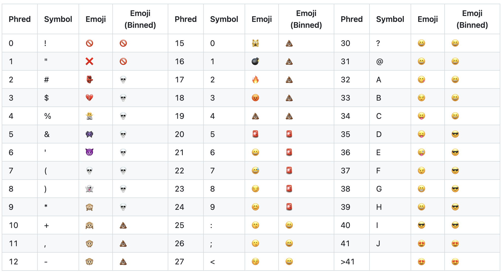
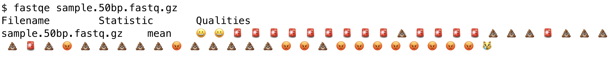
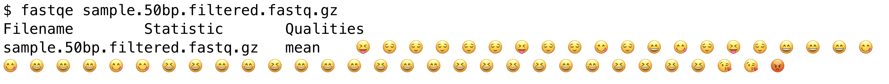
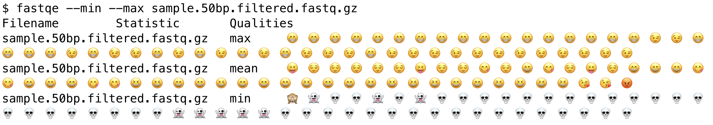
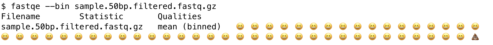
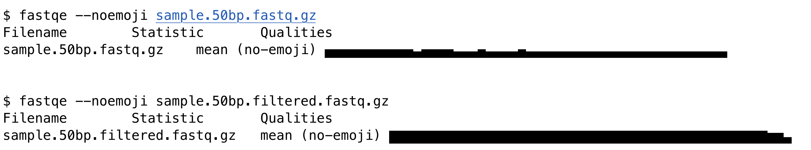
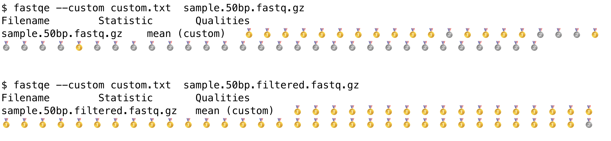

# Summary

Bioinformatics is the science 🧑🏻‍🔬 of understanding and analysing biological information 💡, such as the genetic information contained in DNA 🧬. Modern scientific equipment can measure biological sequences with high accuracy 🎯, yet no technology is flawless and called nucleotide bases can be wrong ❌. Data quality issues need to be assessed and addressed to ensure confidence in downstream interpretation 📝 in medicine and science. 

FASTQE 🤔 is a utility for viewing the quality of biological sequence data by using emoji 😂. It summarises the average quality score for each position in a set of biological sequence measurements, and transcribes that average quality into a corresponding emoji to see the good 😍, the bad 💩,and the ugly 💀 of sequencing data.  When invoked from the command line it can also display the minimum 📉 and maximum 📈 quality scores per position, and bin quality 🗑️ scores into a reduced set of emoji. Custom emoji can also be used 🐍 🌵 👍. 

FASTQE can be used to rapidly 🏃 assess the quality of sequence data. It also helps transform complex 🤯 bioinformatics data into engaging, emoji-based visualisations 📊, making bioinformatics concepts more accessible 😌 and adding an element of fun 🤪 to scientific education 📚 and communication 🗣️.

# Statement of need

Assessing the quality of high-throughput sequencing data is critical for ensuring medical and scientific conclusions drawn from that data are correct. Accounting for technical limitations, contamination, and incorrect data can prevent costly mistakes or incorrect results.  Existing tools for quality assessment often use a GUI or require in-depth knowledge to assess. FASTQC [@fastqc] is the classic tool for sequence quality analysis. Experienced bioinformaticians are familiar with its graphical output format, and education in bioinformatics will include it as elementary content. Recent alternatives that are used where speed and efficiency are critical include fastp [@fastp], falco [@falco] and others, but FASTQC remains the de facto standard.  It is currently the  most effective way to communicate quality scores for sequencing data to other scientists.

FASTQE has the same goal of expressing sequence quality, but fills a need in accessibility and simplicity. As a command-line-first tool, it is designed to be run alongside other bioinformatics tools in environments such as high performance computing clusters. It gives insight into sequence quality in an informal manner. Its feature set is similar to but not as detailed as FASTQC, and focuses on core concepts of sequence quality analysis with an engaging visualization format.

The interpretability of emoji in education and outreach is also important, especially when considering non-English speakers, and FASTQE improves the accessibility and diversity of the audience that biomedical researchers can communicate to. FASTQE is a Python package that can be used in programming exercises, as well as a command line tool. It can be installed both via PyPI and Bioconda. FASTQE offers a fun gateway into the use of the command line, which may also benefit users used to graphical interfaces.

# Design

The design of the FASTQE employs an algorithm to parse FASTQ[@cock_sanger_2010] format files, calculate summary statistics for each base position, and then translate those summary statistics directly to emoji. For clarity, a FASTQ file will contain one or more sequences in a four line format of an @ led identifier, sequence, + led text and quality respectively: 
```
@SEQUENCE_ID
CAACTACAGCTGTTATACTTAGTCTGTAGATATATTAGGGAAGTGAGCTAATTACTATCC
+
%*5F5>)+*!)C+>(((*>>*C%5*%(C%*1C.C)*C(C'-%>')+6C'C%')**+%>)*
```
The quality line uses ASCII characters to encode the Phred quality score for the correspoinding sequence, the most common of which is to use the ASCII code corresponding to the Phred score + 33. The numerical Phred score (Q) is derived from P, the probability of an incorrect base call as such:

Q = -10 * log10(P)

with typical Q scores between 0 and 40 observed, though higher are possible. The higher the Q score, the higher the probability of a correct base call. 

For a given file, every FASTQ sequence is processed using BioPython [@cock_biopython_2009] sequence utilities to extract the numerical qualities. These numerical quality scores at each position are then used to create arrays of the average quality Q score for each position (minimum and maximum are also optional), rounded to the nearest whole integer. To account for recent long-read technologies with variable read lengths, the arrays are dynamically expanded to ensure memory is used efficiently. 

The calculated summary values are then used to create a representative sequence record for each file, where the Q score encodings are calculated from the summary statistics. The ASCII encoded versions of these are then extracted, and Python dictionary lookups are used to map the summary Phred score to an emoji.  The default mappings with Phred score, ASCII character and emoji are shown in \autoref{fig:example}. Binning into simplified emoji is also available to improve impact and reduce visual clutter. 



# Usage

The utility of FASTQE can easily be seen by comparing before and after quality filtering on sequencing data. For some (compressed) data in the FASTQ format , FASTQE will produce by default an emoji for the mean score at each base position. This data clearly has quality issues that need investigating.



After the removal of low-quality sequences, for example with `fastp` or `Trimmomatic` [@Bolger2014-om], the remaining files can be read in with FASTQE to see the effect:



The maximum and minmum quality scores per position can also be displayed in addition to the mean:



Binning is also available to use a reduced set of emoji:



An alternative to emoji can also be used with the `--noemoji` option. In this mode  ASCII boxes can be used to proportionally indicate sequence quality with the height of the box proportional to a higher PHRED score. 



Users can provide a custom mapping of custom emoji to quality in a text file. FASTQE is designed with `pyemojify` to use emoji aliases, e.g. `:crying_cat_face:`, however direct use of emoji in the dictionary is also supported. Revisiting the sample data before and after quality filtering demonstrates the visual narratives possible with custom emoji, such as in this case, turning silver into gold.



Other options include log files, ignoring sequences below a minimum length from the statistics, and suppressing header output. See `fastqe --help` for full details. 

# Conclusion

FASTQE is a software tool that serves both a practical and educational purpose. It can be adapted for many purposes. A resource on sequence quality suitable for high school and undergraduate students has also been developed [@jacques], and it has also been used in short courses and bioinformatics training [@sequence-analysis-quality-control] in [Galaxy](https://usegalaxy.org). Future development includes an enhanced HTML output format for better integration with browser accessible tools such as Galaxy. Everyone knows that using emoji to visualise biological sequencing data is a silly idea. We have shown here that maybe it isn’t as silly as it sounds.

# Acknowledgements

Thanks to the users of FASTQE.  We would also like to thank Ray Enke and the NIBLES incubator team for developing teaching materials using FASTQE.  We would like to acknowledge contributions to FASTQE, including during the BCC2020 CoFest: Björn Grüning, Catherine Bromhead, Clare Sloggett, Clarissa Womack, Helena Rasche, Maria Doyle, Michael Franklin, Nicola Soranzo, Phil Ewels. Additional thanks to Clare Slogget and Genevieve Buckley for manuscript feedback, and the PyCon Au 2024 academic team Maia Sauren and Alan Rubin. 

# References
